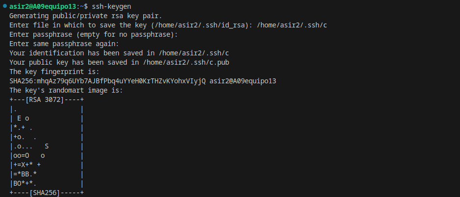
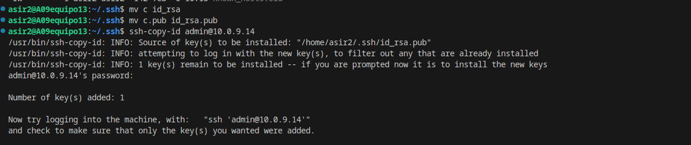
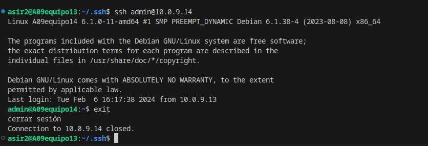

# Conectarse al usuario admin de otra máquina por medio de claves publica y privado

Para conectarse usando las claves publica y privada primero tendremos que ejecutar el comando ssh-keygen el cual genrerará las claves publica y privada.

Una vez hecho el ssh-keygen , tendremos que hace un ssh-copy-id nombre_usuario@ip_equipo.

Como al hacer el ssh key-gen cambie el nombre por defecto con el que se guardan las claves , el sistema no consegui encontrarlas , po lo que hice un mv c id_rsa y  mv c.pub id_rsa.pub (c era el nombre que le habia puesto a la clave).

Para finalizar comprobaremos que al intentar conectarnos mediante ssh no nos pedira la contraseña.

# Como configurar el acceso ssh en el GitHub